# 🏗️ AWS AI/ML Reference Architectures

> **Production-ready architecture patterns for real-world AI/ML applications**

## 🎯 Architecture Overview

This guide provides battle-tested reference architectures that combine AWS AI/ML services across all three tiers for common enterprise use cases.

## 📋 Architecture Catalog

### 1. 🤖 **Intelligent Document Processing**
*Tier 3 + Tier 2 Integration*

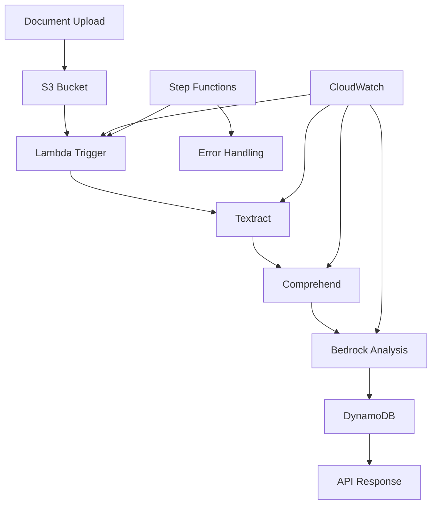

**Components:**
- **S3**: Document storage and versioning
- **Textract**: Text and form extraction
- **Comprehend**: Entity recognition and sentiment
- **Bedrock**: Intelligent summarization and insights
- **Step Functions**: Workflow orchestration
- **DynamoDB**: Metadata and results storage

**Use Cases:**
- Contract analysis and review
- Invoice processing automation
- Legal document classification
- Compliance document review

**Implementation Guide:**
```python
# Document processing pipeline
import boto3

def process_document(bucket, key):
    # Extract text with Textract
    textract = boto3.client('textract')
    response = textract.start_document_text_detection(
        DocumentLocation={'S3Object': {'Bucket': bucket, 'Name': key}}
    )
    
    # Analyze with Comprehend
    comprehend = boto3.client('comprehend')
    entities = comprehend.detect_entities(
        Text=extracted_text,
        LanguageCode='en'
    )
    
    # Generate insights with Bedrock
    bedrock = boto3.client('bedrock-runtime')
    summary = bedrock.invoke_model(
        modelId='anthropic.claude-3-sonnet-20240229-v1:0',
        body=json.dumps({
            "anthropic_version": "bedrock-2023-05-31",
            "messages": [{"role": "user", "content": f"Summarize: {extracted_text}"}]
        })
    )
    
    return {
        'text': extracted_text,
        'entities': entities,
        'summary': summary
    }
```

### 2. 🛒 **E-commerce Recommendation Engine**
*Tier 1 Custom ML + Tier 3 APIs*

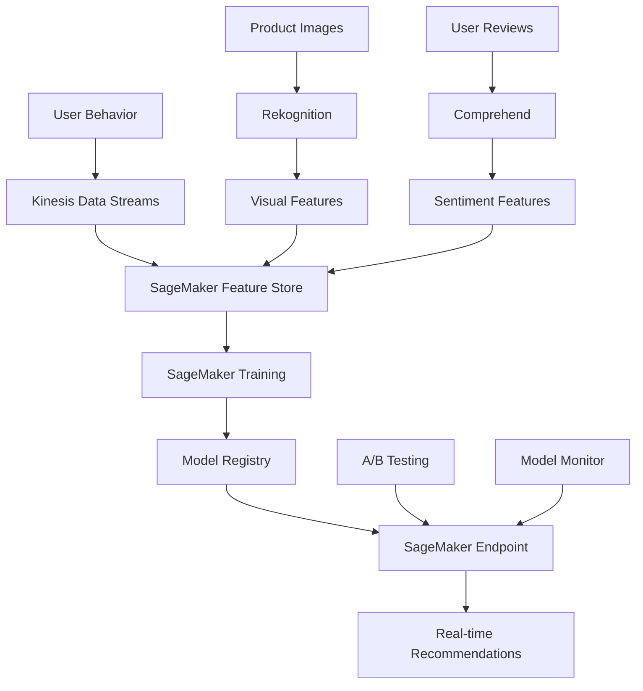

**Components:**
- **SageMaker**: Custom recommendation models
- **Kinesis**: Real-time data streaming
- **Rekognition**: Visual product analysis
- **Comprehend**: Review sentiment analysis
- **Feature Store**: Centralized feature management
- **A/B Testing**: Model performance comparison

**Key Features:**
- Real-time personalization
- Multi-modal recommendations (text + visual)
- Continuous model improvement
- A/B testing framework

### 3. 💬 **Enterprise AI Assistant**
*Full Multi-Tier Integration*

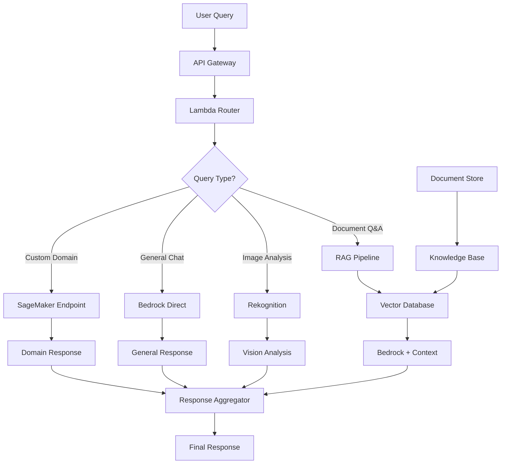

**Architecture Highlights:**
- **Intelligent Routing**: Directs queries to appropriate AI service
- **RAG Integration**: Combines retrieval with generation
- **Multi-modal Support**: Text, images, documents
- **Context Management**: Maintains conversation history
- **Enterprise Security**: VPC, encryption, access controls

**Implementation Pattern:**
```python
class AIAssistant:
    def __init__(self):
        self.bedrock = boto3.client('bedrock-runtime')
        self.rekognition = boto3.client('rekognition')
        self.sagemaker = boto3.client('sagemaker-runtime')
        self.vector_db = VectorDatabase()
    
    def route_query(self, query, context):
        if self.has_image(query):
            return self.process_image(query)
        elif self.needs_domain_knowledge(query):
            return self.rag_response(query, context)
        elif self.is_custom_domain(query):
            return self.custom_model_response(query)
        else:
            return self.general_chat(query)
```

### 4. 🏥 **Healthcare AI Platform**
*Tier 1 Focus with Compliance*

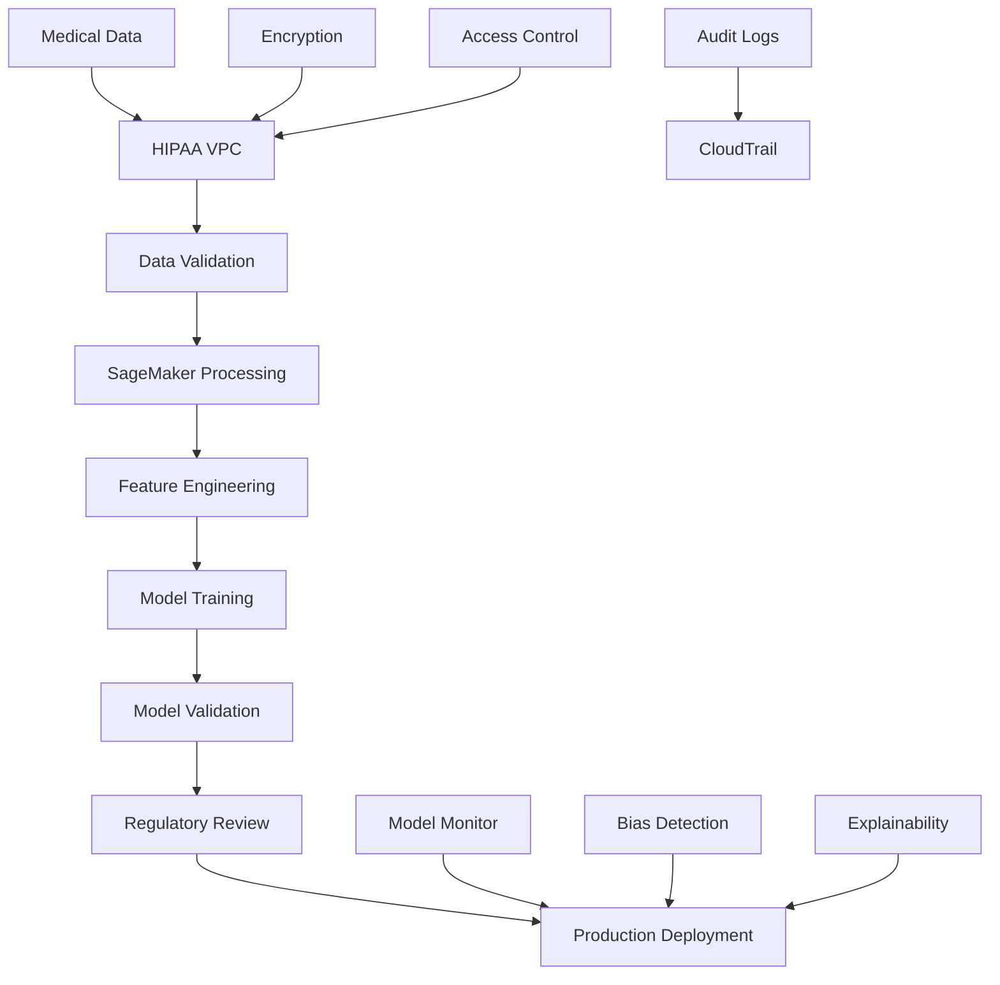

**Compliance Features:**
- **HIPAA Compliance**: Encrypted data, audit trails
- **Model Explainability**: SageMaker Clarify integration
- **Bias Detection**: Continuous monitoring
- **Regulatory Validation**: Automated compliance checks
- **Data Lineage**: Complete audit trail

### 5. 🏭 **Manufacturing Predictive Maintenance**
*IoT + Custom ML Integration*

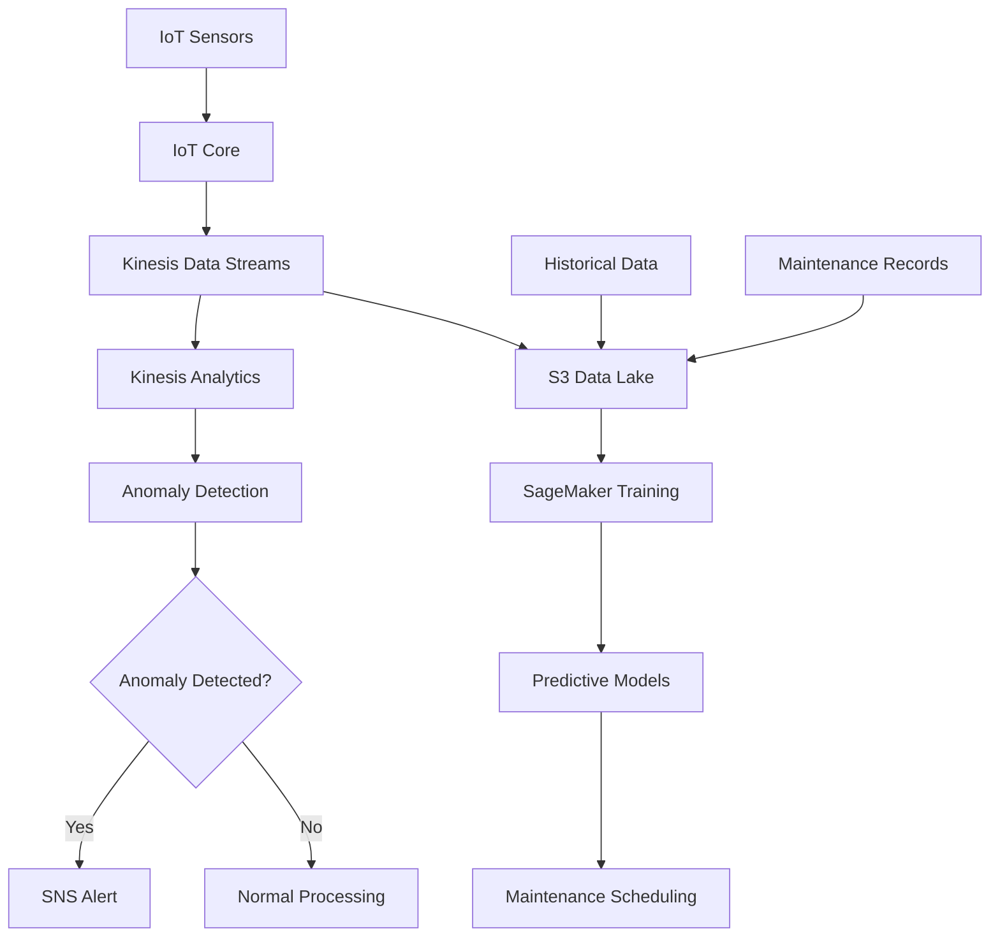

**Key Components:**
- **IoT Integration**: Real-time sensor data collection
- **Stream Processing**: Real-time anomaly detection
- **Predictive Models**: Failure prediction algorithms
- **Alert System**: Automated maintenance notifications
- **Data Lake**: Historical analysis and model training

## 🔧 Implementation Patterns

### Pattern 1: Event-Driven Architecture
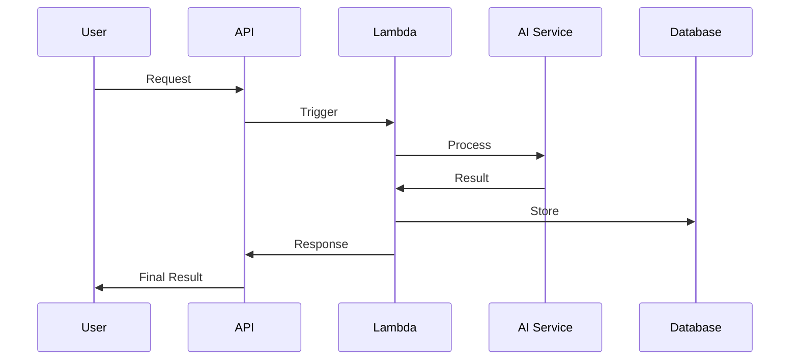

### Pattern 2: Batch Processing Pipeline
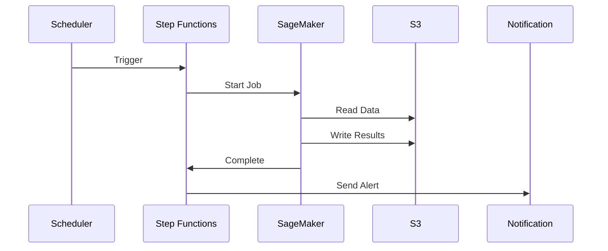

### Pattern 3: Real-time Inference
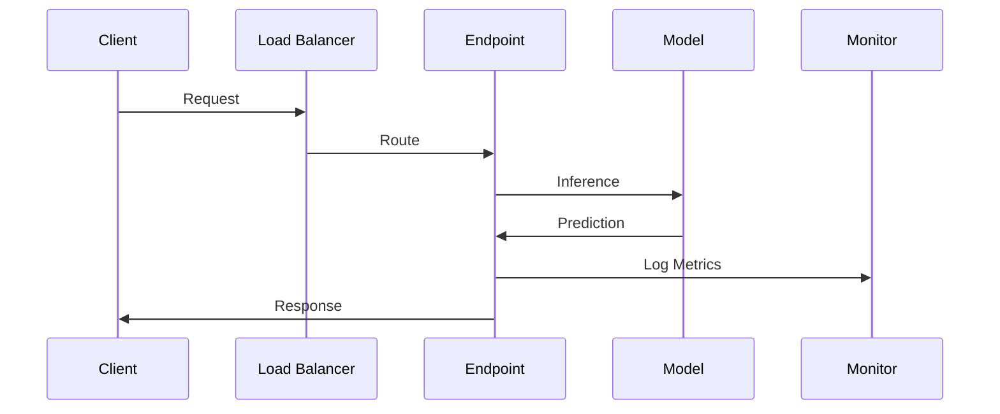

## 🛡️ Security & Compliance Patterns

### Enterprise Security Architecture
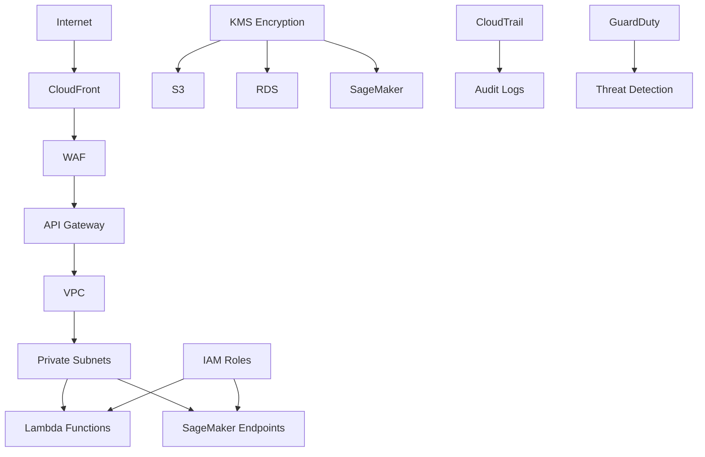

**Security Controls:**
- **Network Isolation**: VPC with private subnets
- **Encryption**: KMS for data at rest and in transit
- **Access Control**: IAM roles and policies
- **Monitoring**: CloudTrail, GuardDuty, CloudWatch
- **Web Protection**: WAF and CloudFront

## 📊 Cost Optimization Patterns

### Multi-Tier Cost Optimization
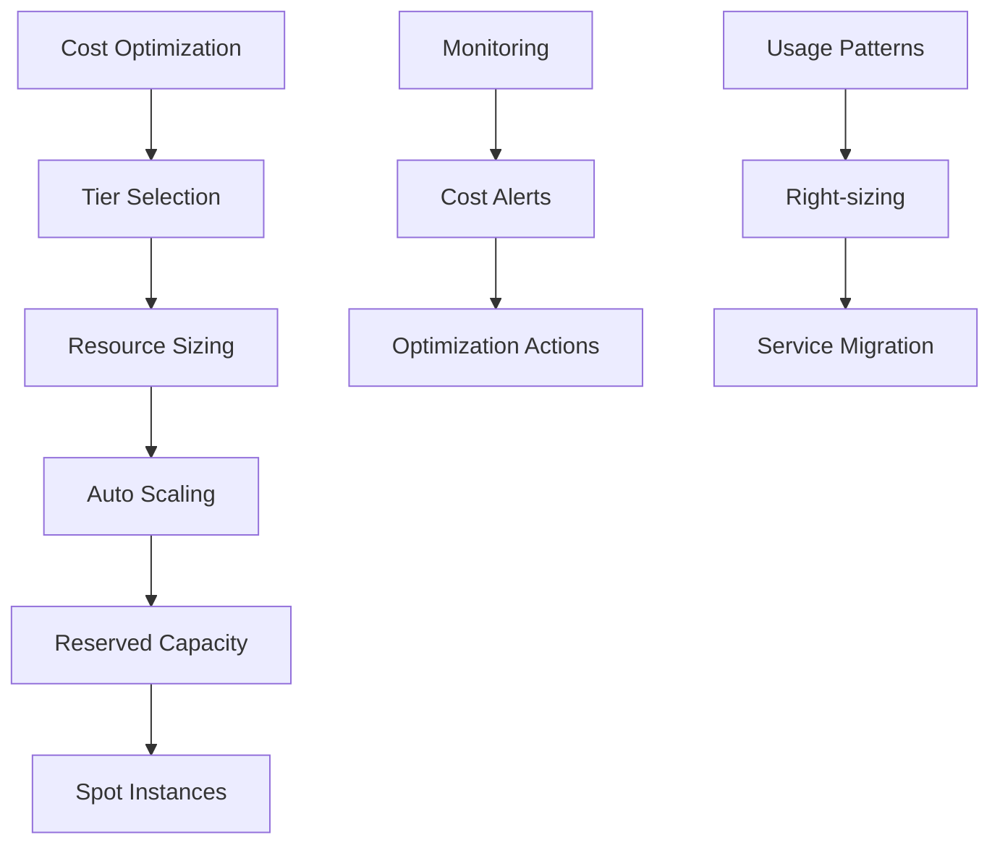

**Cost Strategies:**
1. **Tier Optimization**: Use appropriate tier for each use case
2. **Auto Scaling**: Scale resources based on demand
3. **Spot Instances**: Use for training workloads
4. **Reserved Capacity**: For predictable workloads
5. **Monitoring**: Continuous cost tracking and optimization

## 🚀 Deployment Patterns

### CI/CD for AI/ML
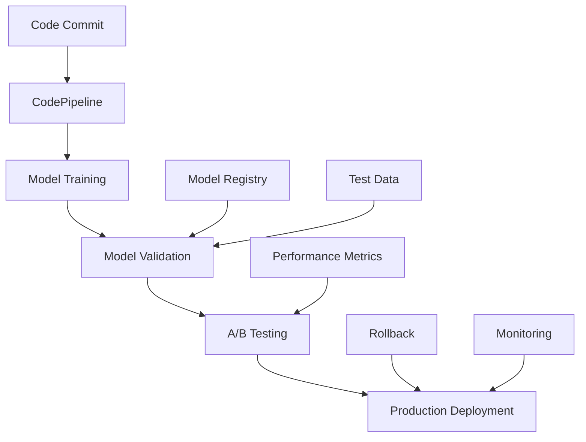

**Deployment Stages:**
1. **Model Training**: Automated training pipeline
2. **Validation**: Model performance testing
3. **A/B Testing**: Gradual rollout with comparison
4. **Production**: Full deployment with monitoring
5. **Rollback**: Automated rollback on issues

## 📈 Monitoring & Observability

### Comprehensive Monitoring Stack
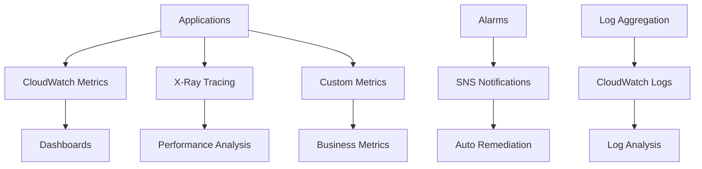

**Monitoring Components:**
- **Performance Metrics**: Latency, throughput, errors
- **Business Metrics**: Accuracy, user satisfaction
- **Infrastructure Metrics**: Resource utilization
- **Cost Metrics**: Service costs and optimization opportunities

---

🏗️ **Ready to implement?** Choose an architecture pattern and follow our [Implementation Guides](./implementation-guides/) for step-by-step instructions.