# 🌳 AWS AI/ML Architecture Decision Tree

> **Visual guide to choosing the right AWS AI/ML services for your use case**

## 🎯 Quick Decision Framework

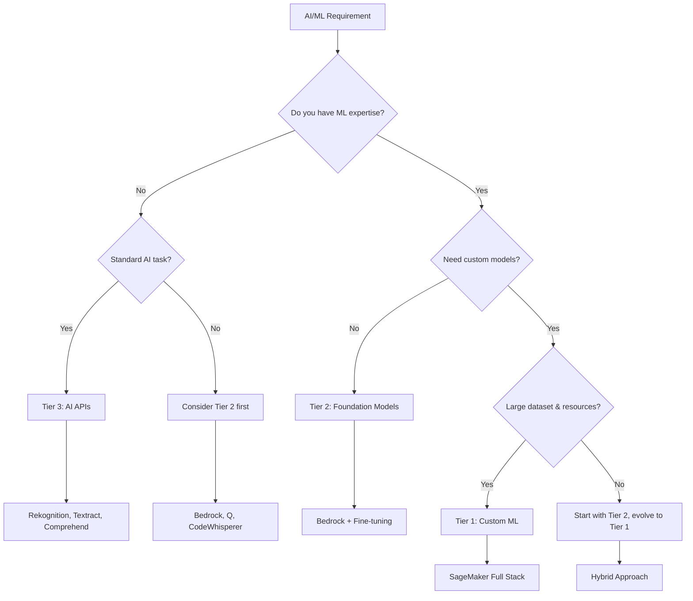

## 🔍 Detailed Decision Matrix

### Use Case Categories

#### 🖼️ **Computer Vision**
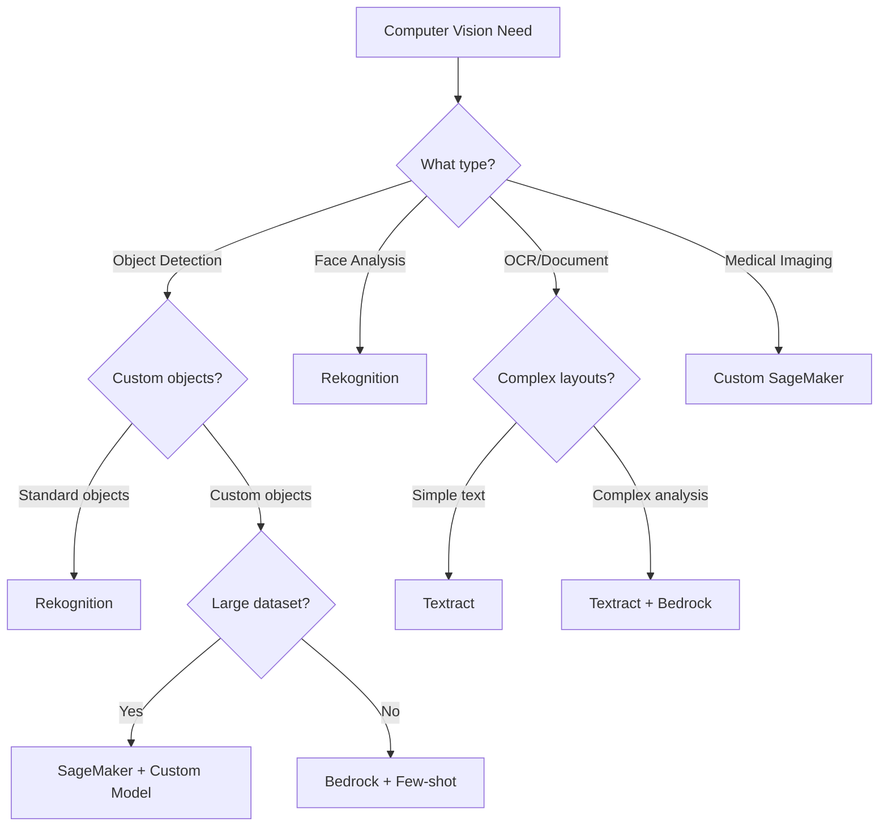

**Decision Criteria:**
- **Tier 3 (Rekognition)**: Standard objects, faces, celebrities, text
- **Tier 2 (Bedrock)**: Custom analysis with prompts, few-shot learning
- **Tier 1 (SageMaker)**: Unique objects, medical imaging, high accuracy needs

#### 💬 **Natural Language Processing**
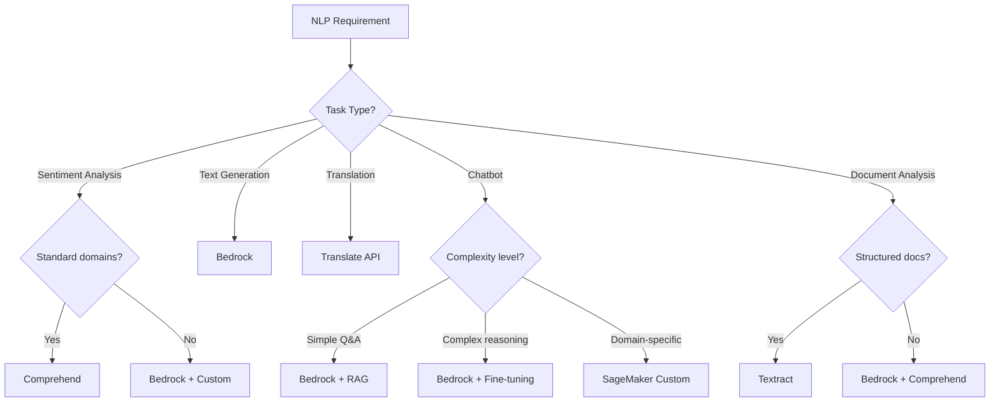

**Decision Criteria:**
- **Tier 3**: Standard sentiment, entity extraction, translation
- **Tier 2**: Conversational AI, content generation, RAG systems
- **Tier 1**: Domain-specific models, high-performance requirements

#### 🎵 **Audio Processing**
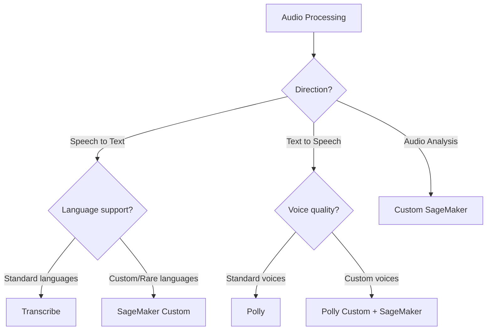

## 🏗️ Architecture Patterns

### Pattern 1: API-First (Tier 3)
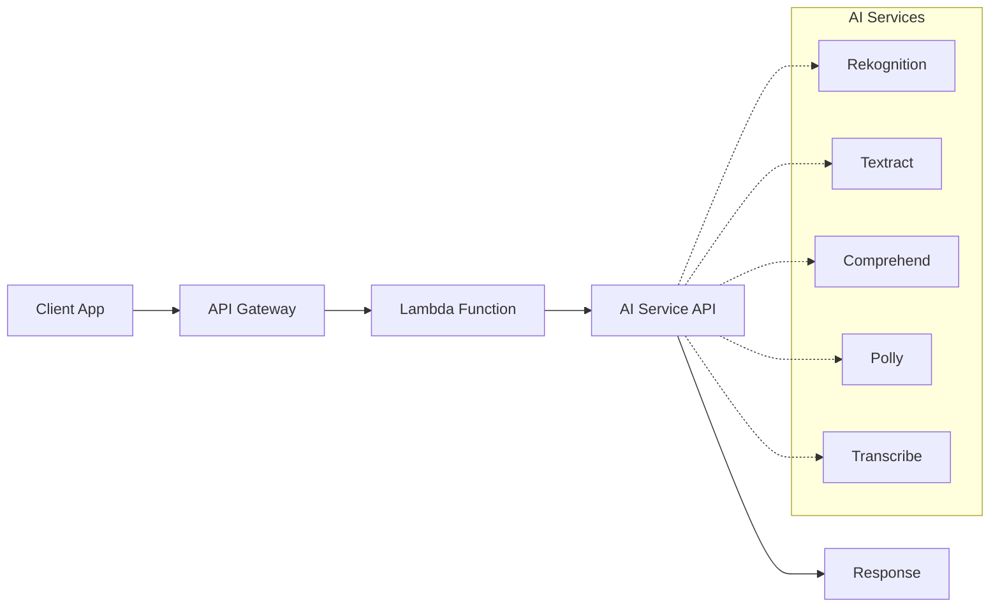

**Best For:**
- Rapid prototyping
- Standard AI features
- Small to medium scale
- Limited ML expertise

### Pattern 2: Foundation Model Hub (Tier 2)
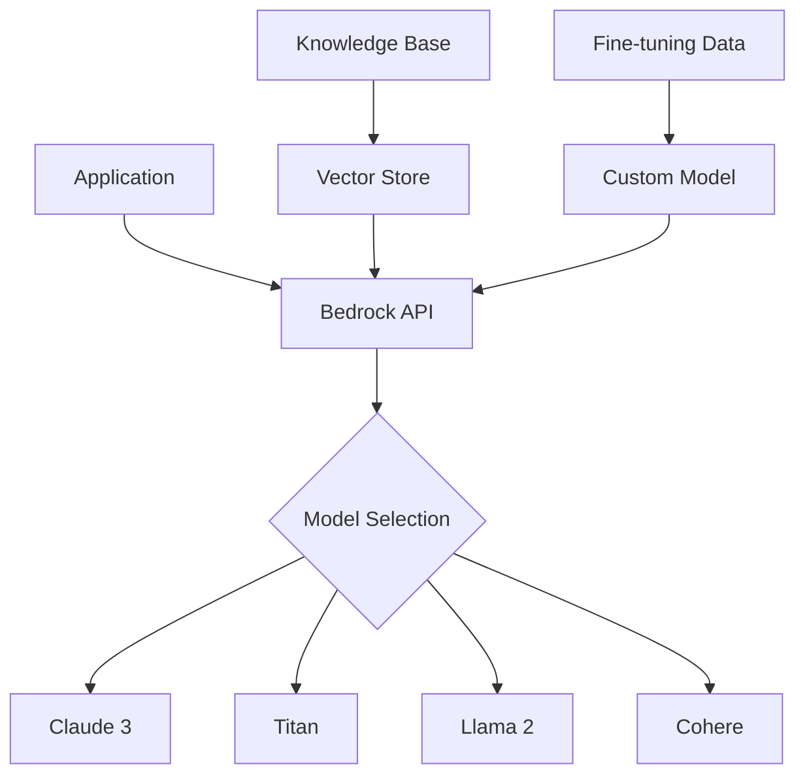

**Best For:**
- Generative AI applications
- RAG implementations
- Conversational interfaces
- Content generation

### Pattern 3: Custom ML Pipeline (Tier 1)
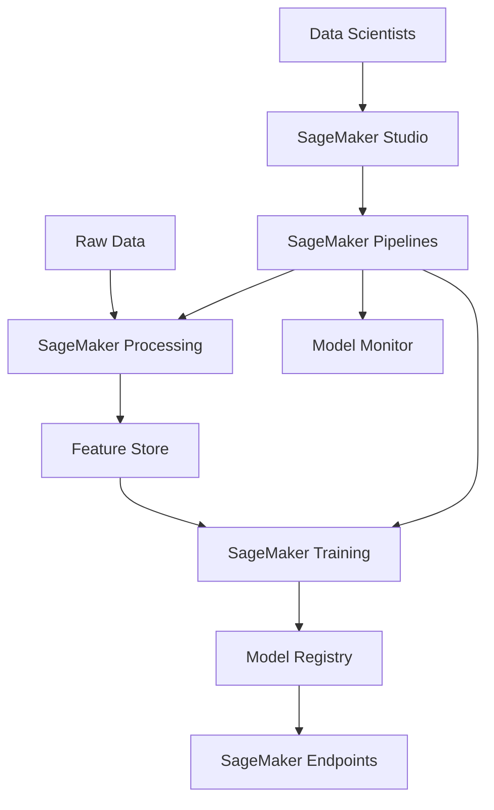

**Best For:**
- Custom algorithms
- Large-scale ML operations
- Regulatory requirements
- Performance optimization

### Pattern 4: Hybrid Multi-Tier
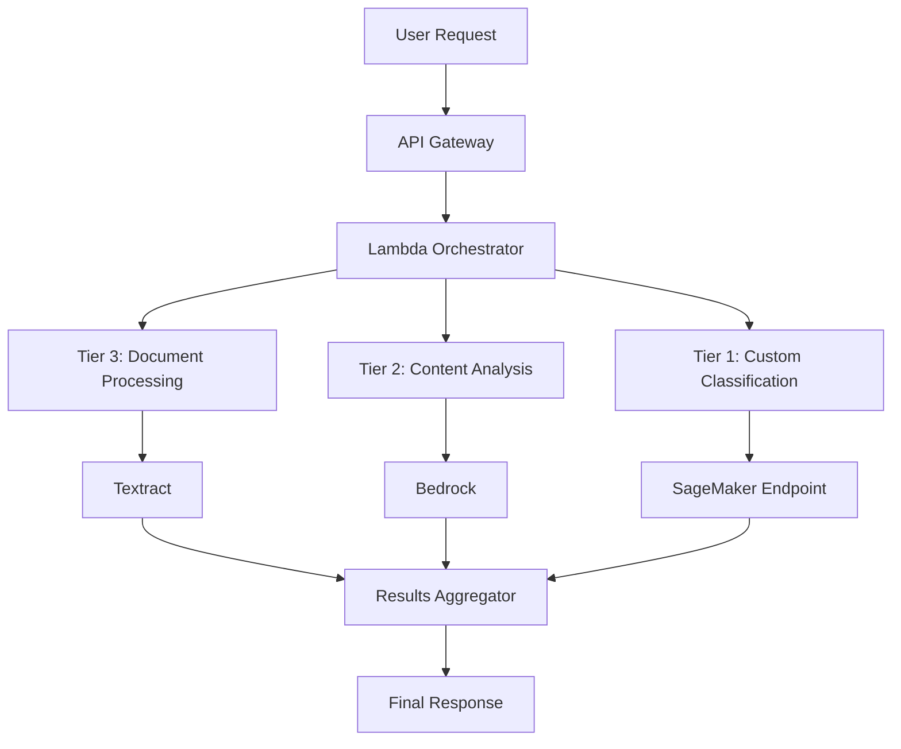

**Best For:**
- Complex workflows
- Multiple AI capabilities
- Enterprise applications
- Scalable solutions

## 💰 Cost Decision Framework

### Cost Comparison Matrix

| Tier | Setup Cost | Operational Cost | Scale Economics | Best For Budget |
|------|------------|------------------|-----------------|-----------------|
| **Tier 3** | $0 | Per API call | Linear scaling | Small-Medium |
| **Tier 2** | $0 | Per token/request | Volume discounts | Variable usage |
| **Tier 1** | High | Compute + Storage | Economies of scale | High volume |

### Cost Optimization Decision Tree
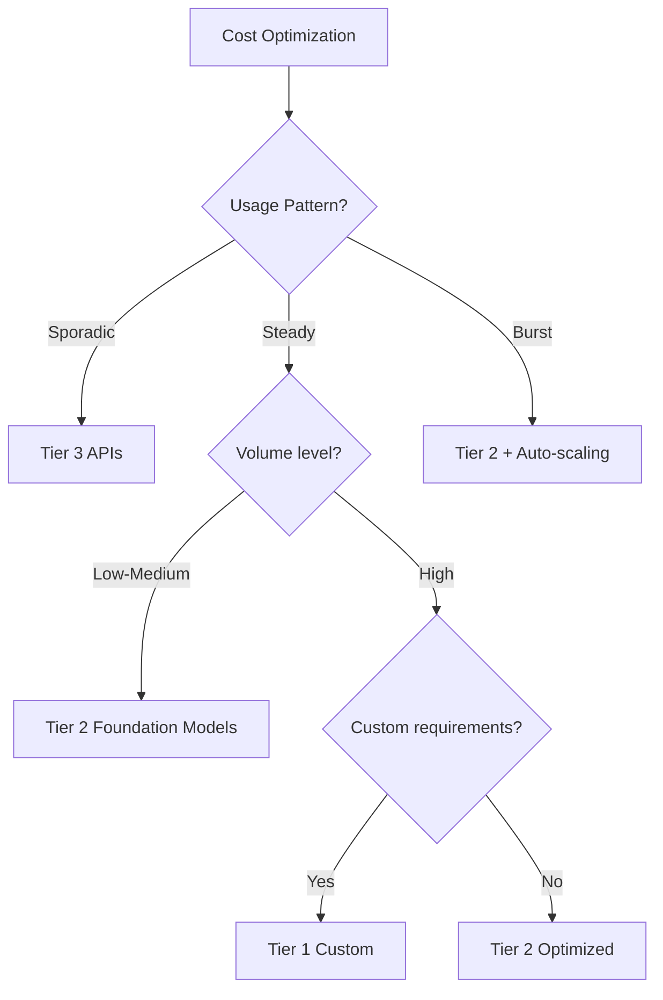

## 🚀 Performance Decision Framework

### Latency Requirements
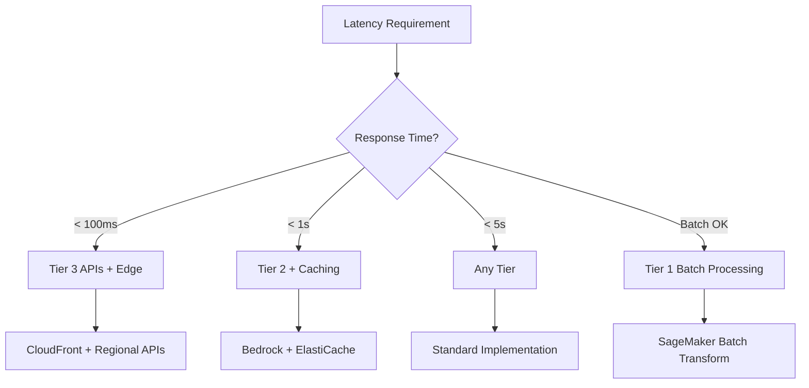

### Accuracy Requirements
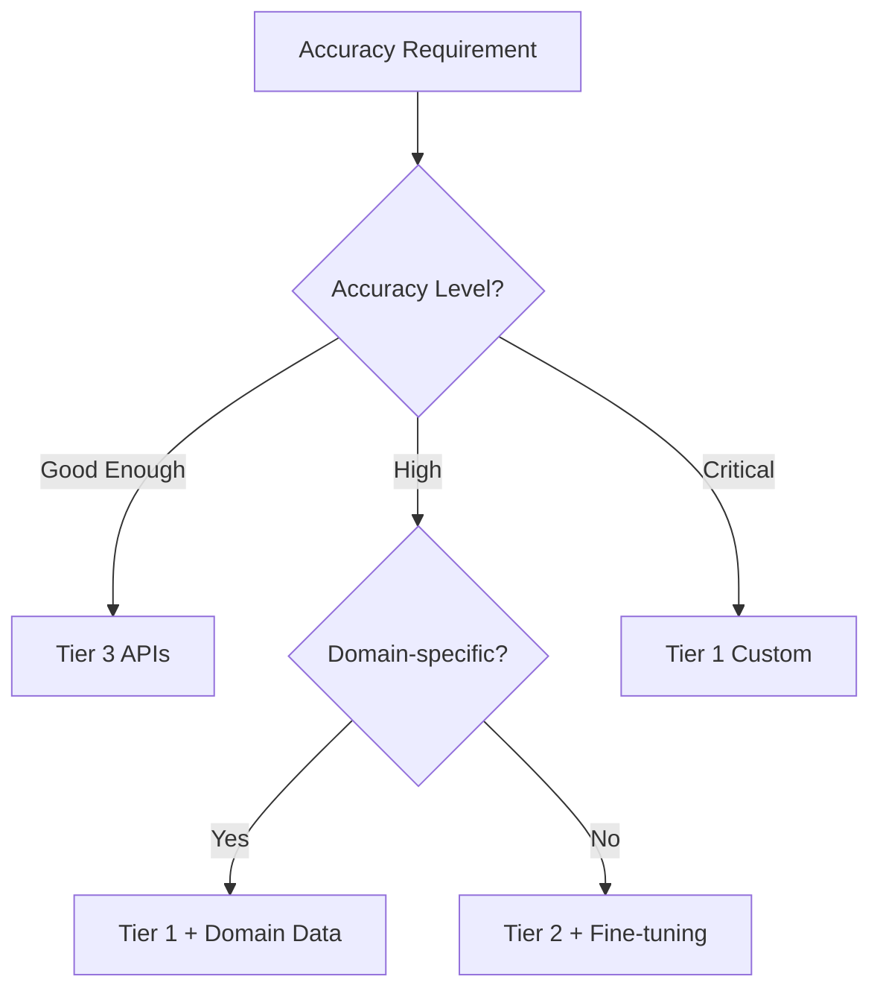

## 📊 Decision Scorecard

### Service Selection Scorecard

| Criteria | Weight | Tier 3 | Tier 2 | Tier 1 |
|----------|--------|--------|--------|--------|
| **Speed to Market** | 25% | 9/10 | 7/10 | 4/10 |
| **Customization** | 20% | 3/10 | 7/10 | 10/10 |
| **Cost (Small Scale)** | 15% | 9/10 | 8/10 | 5/10 |
| **Cost (Large Scale)** | 15% | 6/10 | 7/10 | 9/10 |
| **Maintenance** | 10% | 9/10 | 8/10 | 5/10 |
| **Performance** | 10% | 7/10 | 8/10 | 10/10 |
| **Expertise Required** | 5% | 9/10 | 6/10 | 3/10 |

### Use This Scorecard:
1. Rate importance of each criteria (1-10)
2. Calculate weighted scores
3. Choose highest scoring tier
4. Validate with architecture patterns

## 🎯 Quick Reference Guide

### When to Choose Each Tier

#### ✅ **Choose Tier 3 When:**
- Standard AI functionality needed
- Quick implementation required
- Limited ML expertise
- Small to medium scale
- Proven use cases (face detection, sentiment analysis)

#### ✅ **Choose Tier 2 When:**
- Generative AI capabilities needed
- Conversational interfaces
- Content generation/analysis
- RAG implementations
- Moderate customization required

#### ✅ **Choose Tier 1 When:**
- Unique business requirements
- Custom algorithms needed
- Large-scale operations
- Regulatory compliance
- Performance optimization critical

#### ✅ **Choose Hybrid When:**
- Complex workflows
- Multiple AI capabilities
- Enterprise applications
- Different requirements per component

---

🎯 **Need help deciding?** Use our [Interactive Decision Tool](./interactive-decision-tool.md) or join our [Community Discussions](https://github.com/your-username/aws-ai-ml-landscape-2026/discussions)