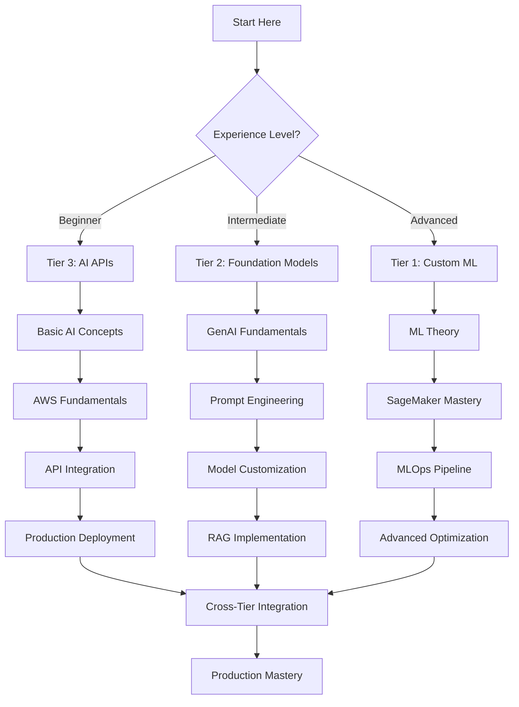
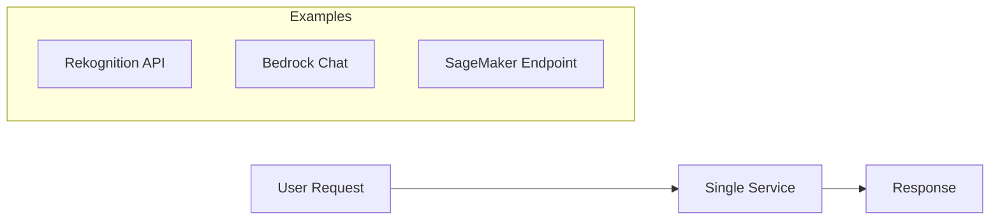
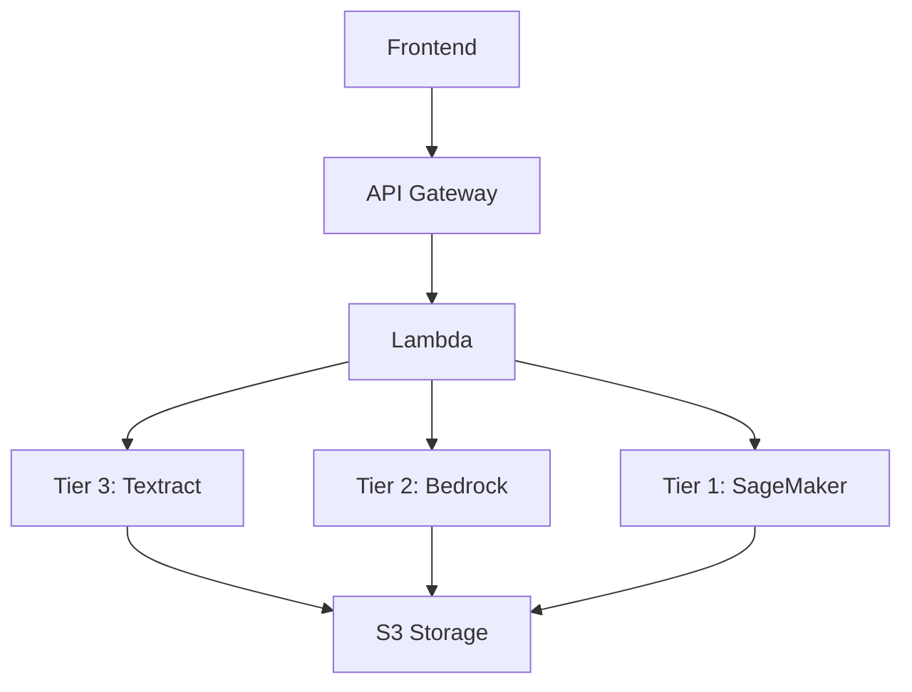
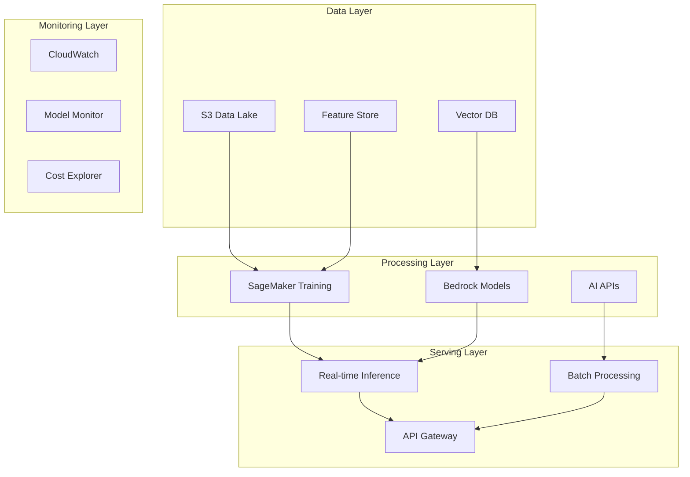
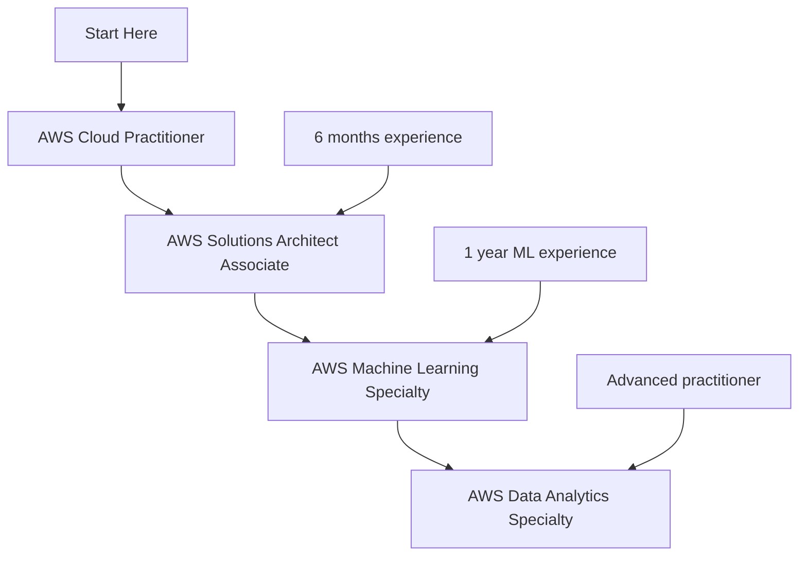

# 🎓 AWS AI/ML Learning Path 2026

> **Complete roadmap from beginner to expert across all three tiers**

## 🗺️ Learning Journey Overview

## 🎯 Learning Paths by Experience Level

### 🟢 **Beginner Path: AI APIs First** (4-6 weeks)
*Perfect for developers new to AI/ML*

#### Week 1-2: Foundations
- **AWS Basics** (8 hours)
  - [AWS Cloud Practitioner Essentials](https://aws.amazon.com/training/digital/aws-cloud-practitioner-essentials/)
  - [AWS Free Tier Setup](https://aws.amazon.com/free/)
  - [IAM Fundamentals](https://docs.aws.amazon.com/IAM/latest/UserGuide/introduction.html)

- **AI Concepts** (6 hours)
  - [AI/ML Fundamentals](https://aws.amazon.com/machine-learning/what-is-ai/)
  - [Computer Vision Basics](https://aws.amazon.com/what-is/computer-vision/)
  - [Natural Language Processing](https://aws.amazon.com/what-is/nlp/)

#### Week 3-4: Hands-on APIs
- **Amazon Rekognition** (10 hours)
  - [Getting Started Guide](https://docs.aws.amazon.com/rekognition/latest/dg/getting-started.html)
  - [Image Analysis Lab](./labs/rekognition-basics.md)
  - [Face Detection Project](./projects/face-detection-app.md)

- **Amazon Textract** (8 hours)
  - [Document Analysis Tutorial](https://docs.aws.amazon.com/textract/latest/dg/getting-started.html)
  - [Form Processing Lab](./labs/textract-forms.md)

#### Week 5-6: Integration & Deployment
- **API Integration** (12 hours)
  - [REST API with Lambda](./labs/lambda-api-integration.md)
  - [Frontend Integration](./labs/react-ai-app.md)
  - [Production Deployment](./labs/production-deployment.md)

**📋 Beginner Checklist:**
- [ ] Complete 3 AI API projects
- [ ] Deploy one production application
- [ ] Understand cost optimization basics
- [ ] Ready for Tier 2 exploration

### 🟡 **Intermediate Path: Foundation Models** (6-8 weeks)
*For developers ready to explore GenAI*

#### Week 1-2: GenAI Foundations
- **Generative AI Concepts** (10 hours)
  - [Introduction to GenAI](https://aws.amazon.com/what-is/generative-ai/)
  - [Large Language Models](https://aws.amazon.com/what-is/large-language-model/)
  - [Foundation Models Overview](https://aws.amazon.com/bedrock/foundation-models/)

- **Amazon Bedrock Basics** (8 hours)
  - [Bedrock Getting Started](https://docs.aws.amazon.com/bedrock/latest/userguide/getting-started.html)
  - [Model Comparison Guide](./guides/bedrock-model-comparison.md)

#### Week 3-4: Prompt Engineering
- **Advanced Prompting** (12 hours)
  - [Prompt Engineering Guide](./guides/prompt-engineering-masterclass.md)
  - [Chain-of-Thought Techniques](./labs/advanced-prompting.md)
  - [Few-Shot Learning](./labs/few-shot-examples.md)

#### Week 5-6: RAG Implementation
- **Retrieval Augmented Generation** (15 hours)
  - [RAG Architecture](./architectures/rag-patterns.md)
  - [Vector Databases](./guides/vector-db-comparison.md)
  - [Knowledge Base Setup](./labs/rag-implementation.md)

#### Week 7-8: Production GenAI
- **Scaling & Optimization** (10 hours)
  - [Model Fine-tuning](./labs/bedrock-fine-tuning.md)
  - [Cost Optimization](./guides/genai-cost-optimization.md)
  - [Production Monitoring](./labs/genai-monitoring.md)

**📋 Intermediate Checklist:**
- [ ] Build a RAG application
- [ ] Implement prompt optimization
- [ ] Deploy production GenAI service
- [ ] Understand model selection criteria

### 🔴 **Advanced Path: Custom ML** (8-12 weeks)
*For ML engineers and data scientists*

#### Week 1-3: ML Engineering Foundations
- **SageMaker Mastery** (20 hours)
  - [SageMaker Studio Deep Dive](https://docs.aws.amazon.com/sagemaker/latest/dg/studio.html)
  - [Training Jobs & Experiments](./labs/sagemaker-training.md)
  - [Model Registry & Versioning](./labs/model-management.md)

#### Week 4-6: MLOps Pipeline
- **End-to-End Pipeline** (25 hours)
  - [SageMaker Pipelines](./labs/mlops-pipeline.md)
  - [CI/CD for ML](./labs/ml-cicd.md)
  - [Model Monitoring](./labs/model-monitoring.md)

#### Week 7-9: Advanced Techniques
- **Optimization & Scaling** (20 hours)
  - [Distributed Training](./labs/distributed-training.md)
  - [Model Optimization](./labs/model-optimization.md)
  - [Multi-Model Endpoints](./labs/multi-model-endpoints.md)

#### Week 10-12: Production Excellence
- **Enterprise ML** (15 hours)
  - [Security & Compliance](./guides/ml-security.md)
  - [Cost Optimization](./guides/ml-cost-optimization.md)
  - [Governance & Lineage](./labs/ml-governance.md)

**📋 Advanced Checklist:**
- [ ] Build complete MLOps pipeline
- [ ] Implement distributed training
- [ ] Deploy multi-model production system
- [ ] Establish ML governance framework

## 🏗️ Architecture Learning Path

### Phase 1: Single-Tier Solutions

### Phase 2: Multi-Tier Integration

### Phase 3: Enterprise Architecture

## 📚 Resource Library

### 🎥 Video Courses
- [AWS AI/ML Specialty Certification](https://aws.amazon.com/certification/certified-machine-learning-specialty/)
- [Deep Learning on AWS](https://www.coursera.org/learn/aws-machine-learning)
- [Practical AI on AWS](https://acloudguru.com/course/aws-certified-machine-learning-specialty)

### 📖 Documentation
- [AWS AI/ML Developer Guide](https://docs.aws.amazon.com/machine-learning/)
- [SageMaker Developer Guide](https://docs.aws.amazon.com/sagemaker/)
- [Bedrock User Guide](https://docs.aws.amazon.com/bedrock/)

### 🛠️ Hands-on Labs
- [AWS AI/ML Workshops](https://workshops.aws/categories/Machine%20Learning)
- [SageMaker Examples](https://github.com/aws/amazon-sagemaker-examples)
- [Bedrock Samples](https://github.com/aws-samples/amazon-bedrock-samples)

### 📊 Practice Projects
1. **Beginner**: [Smart Photo Album](./projects/smart-photo-album.md)
2. **Intermediate**: [AI Customer Support](./projects/ai-customer-support.md)
3. **Advanced**: [Predictive Maintenance](./projects/predictive-maintenance.md)

## 🎯 Certification Roadmap

## 📈 Progress Tracking

### Beginner Milestones
- [ ] Week 2: First AI API call successful
- [ ] Week 4: Complete image recognition app
- [ ] Week 6: Production deployment live

### Intermediate Milestones
- [ ] Week 2: First Bedrock model interaction
- [ ] Week 4: Prompt engineering mastery
- [ ] Week 6: RAG system operational
- [ ] Week 8: Production GenAI service

### Advanced Milestones
- [ ] Week 3: SageMaker training job complete
- [ ] Week 6: MLOps pipeline operational
- [ ] Week 9: Distributed training successful
- [ ] Week 12: Enterprise ML system deployed

## 🤝 Community & Support

- **AWS AI/ML Community**: [re:Post ML Forum](https://repost.aws/tags/machine-learning)
- **GitHub Discussions**: [Project Discussions](https://github.com/your-username/aws-ai-ml-landscape-2026/discussions)
- **Weekly Office Hours**: Every Friday 2PM EST
- **Slack Community**: [Join Here](https://join.slack.com/aws-ai-ml-2026)

---

🚀 **Ready to start your journey?** Choose your path and begin with Week 1!